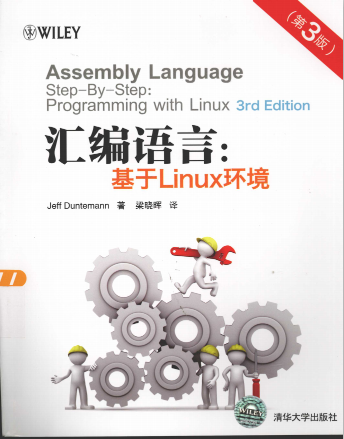

# NASM-Assembly_Language_Step_by_step_with_linux
### Linux下的nasm格式汇编《汇编语言：基于LINUX 环境（第3版）》 
本仓库实现《汇编语言:基于Linux环境 》中全部案例 

### 参考书籍
[《汇编语言:基于Linux环境 》](https://github.com/IammyselfYBX/NASM-Assembly_Language_Step_by_step_with_linux/tree/master/BOOKS)
